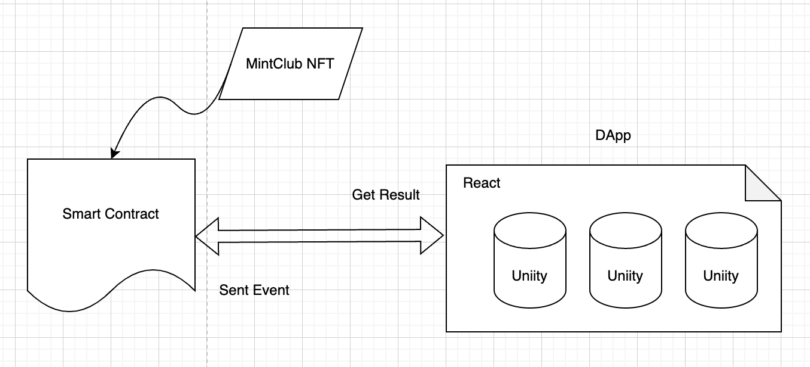
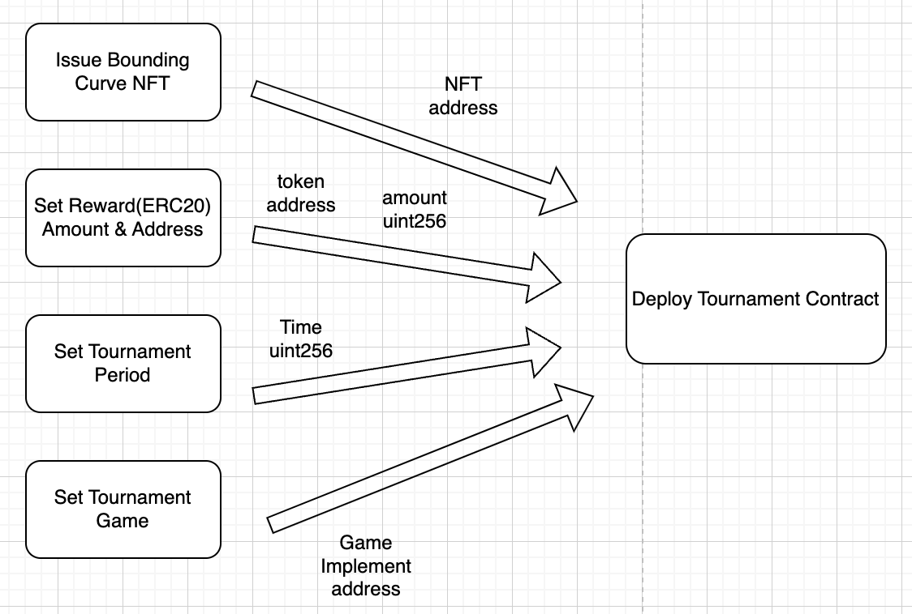
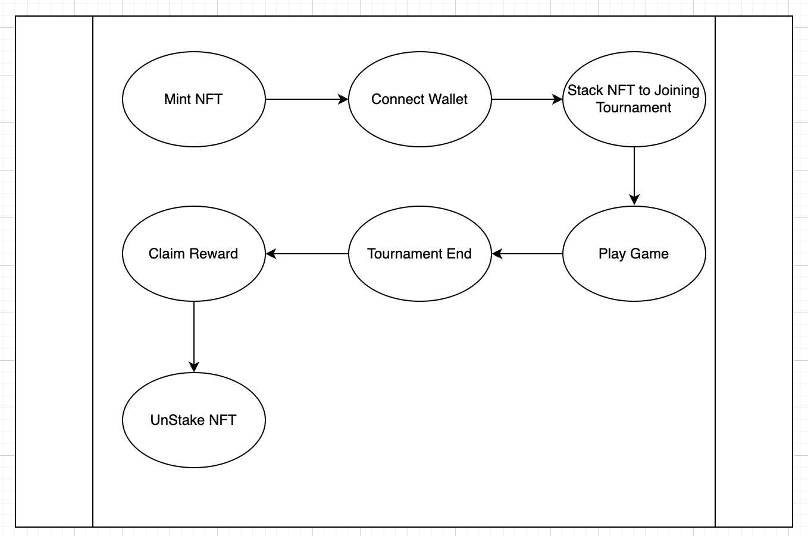
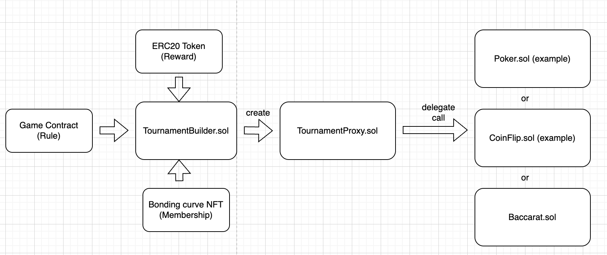

# BaroCasino

BaroCasino is a revolutionary tournament DApp that leverages the power of Mint Club Bounding Curve NFTs to create a decentralized and accessible gaming experience. With BaroCasino, anyone can become a tournament host and participate in exciting competitions with real-world rewards.

For more info please read [Deck](https://www.canva.com/design/DAGAJVy4sMk/dugWolPYsTusxAELCTXojg/view?utm_content=DAGAJVy4sMk&utm_campaign=designshare&utm_medium=link&utm_source=editor)

## Features:

- Decentralized tournament hosting
- Mint Club Bounding Curve NFTs as tournament tickets
- Built on the OPT blockchain
- Accessible and inclusive

## Technologies:
- Foundry
- React
- Unity
- OPT blockchain

## Structure:



BaroCasino offers a unique decentralized platform for hosting and participating in gaming tournaments. The platform's architecture is designed to accommodate two main roles: **Tournament Creators** and **Tournament Players**, facilitating a seamless flow from the creation of a tournament to the distribution of rewards.

## Roles
### Tournament Creators:
Tournament Creators are the backbone of the BaroCasino ecosystem. They initiate tournaments by creating Mint Club NFTs, which serve as membership tickets for players to buy and participate in the tournaments. The process for Tournament Creators involves:
- **Creating Mint Club NFTs**: These NFTs act as access tokens for the tournaments. Creators decide the terms, rewards, and structure of the tournaments.
- **Hosting Tournaments**: Once the NFTs are minted, creators can set up tournaments on the BaroCasino platform, inviting players to join and compete.



### Tournament Players:
Players engage with the platform by participating in these tournaments. Their journey within the BaroCasino ecosystem involves several steps:
- **Purchasing Mint Club NFTs**: Players buy Mint Club NFTs from the marketplace, granting them membership and the ability to join tournaments.
- **Participating in Tournaments**: Using their NFTs, players enter tournaments, compete, and aim for the top positions to win rewards.
- **Claiming Rewards and NFTs**: At the end of a tournament, players can claim their rewards along with their staked NFTs, which can be reused for future tournaments or traded.


### Contract Architecture:
The BaroCasino platform leverages smart contracts to manage the creation of tournaments, issuance of NFTs, and distribution of rewards. These contracts ensure transparency, security, and trustless interactions within the ecosystem. The contract architecture supports:
- **NFT Minting and Management**: Smart contracts for creating, buying, and selling Mint Club NFTs.
- **Tournament Creation and Management**: Contracts that allow creators to set up and manage tournaments.
- **Reward Distribution**: Mechanisms for distributing rewards to winners and returning NFTs to participants.



## Getting Started:

To get started with BaroCasino, you will need to have the following installed:
Node.js
Yarn
Once you have installed the required dependencies, you can clone the BaroCasino repository from GitHub:
```
git clone https://github.com/your-username/barocasino.git
```

Once you have cloned the repository, you can install the project's dependencies:
```
yarn install
```

To start the React web application:
```
yarn start
```

To start foundry development please follow the [foundry instructions](foundry/README.md)

BaroCasino is an open source project, and we welcome contributions from the community. If you would like to contribute to BaroCasino, please fork the repository and submit a pull request.

License:
BaroCasino is licensed under the MIT License.

